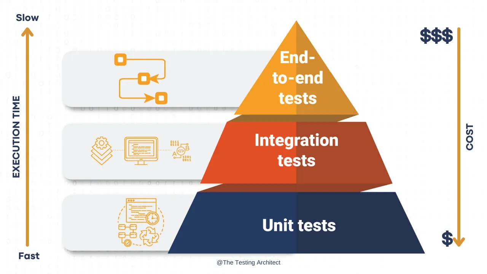

# 2. Testing Strategy

## Status

## Context

We need to define a testing strategy for the project. This strategy should be able to be applied to all the different
components of the project.

## Decision

We'll follow the testing pyramid strategy. This strategy is based on the idea that we should have more unit tests than
integration tests and more integration tests than e2e tests.

We will use a combination of unit tests, integration tests & e2e tests to ensure the quality of the project. We'll also
add a set of mutation tests to ensure the quality of the tests.

We'll start with unit tests as they are fasts, then integration tests and finally e2e tests. We'll also add mutation
tests to ensure that
the tests are actually testing the code.
s

## Consequences

This strategy will allow us to build a robust software with a high quality. It will also allow us to refactor the code
easily if needed.

