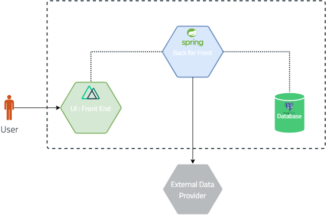

# Overall architecture

The overall architecture of the system is shown in the figure below. The system is divided into two main parts: the *
**Web App**, the **Back For Front API**

## Architecture diagram

The architecture of our application is the following:

- The Web Application is the part that the user interacts with.
- The BFF API is the part that handles the requests from the Web Application and communicates with the Database.
- The Database is the part that stores the data.
- The BFF API communicates sometimes with the external API in order to retrieve some business rules related to
  calculating taxes.

## Future changes

There may be changes in the architecture in the future. so we'll try to make it as flexible as possible.

